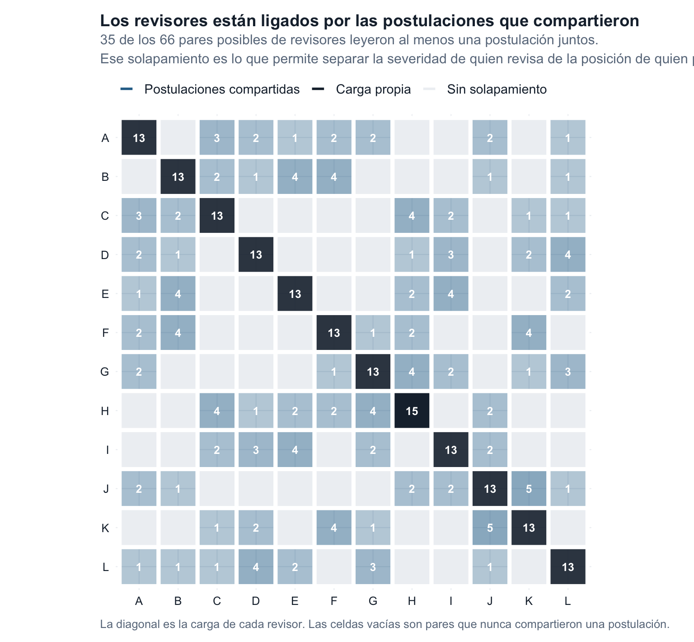
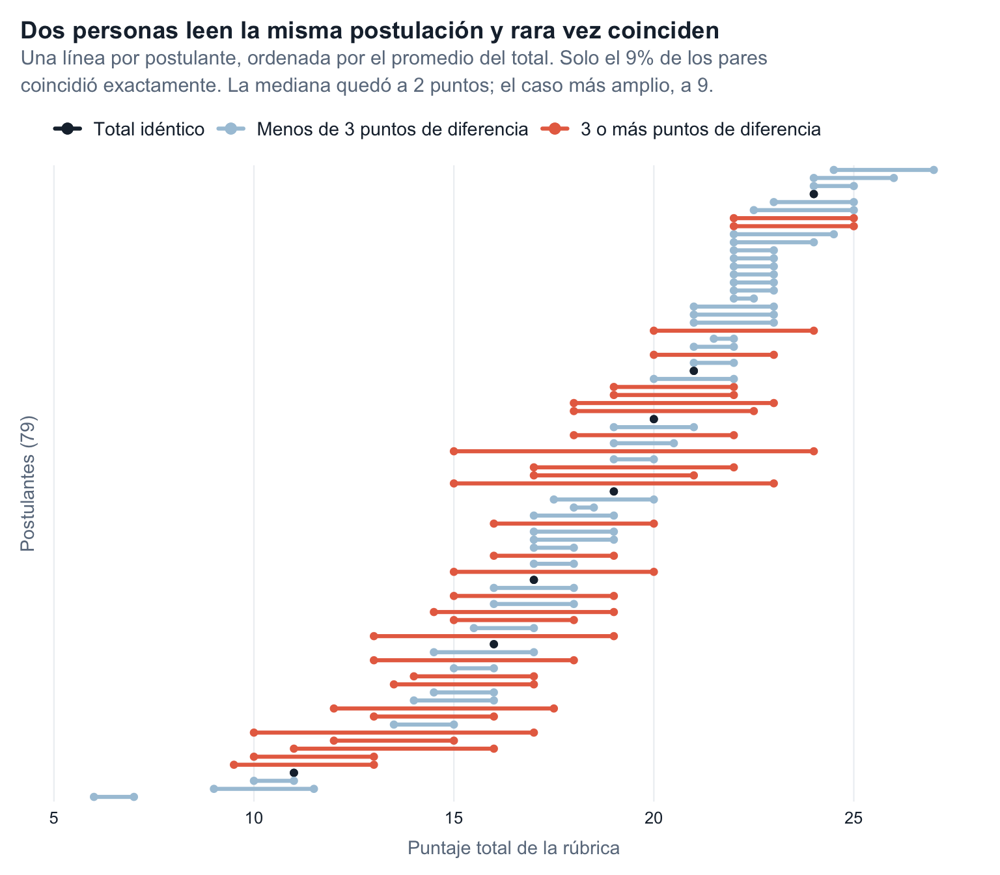
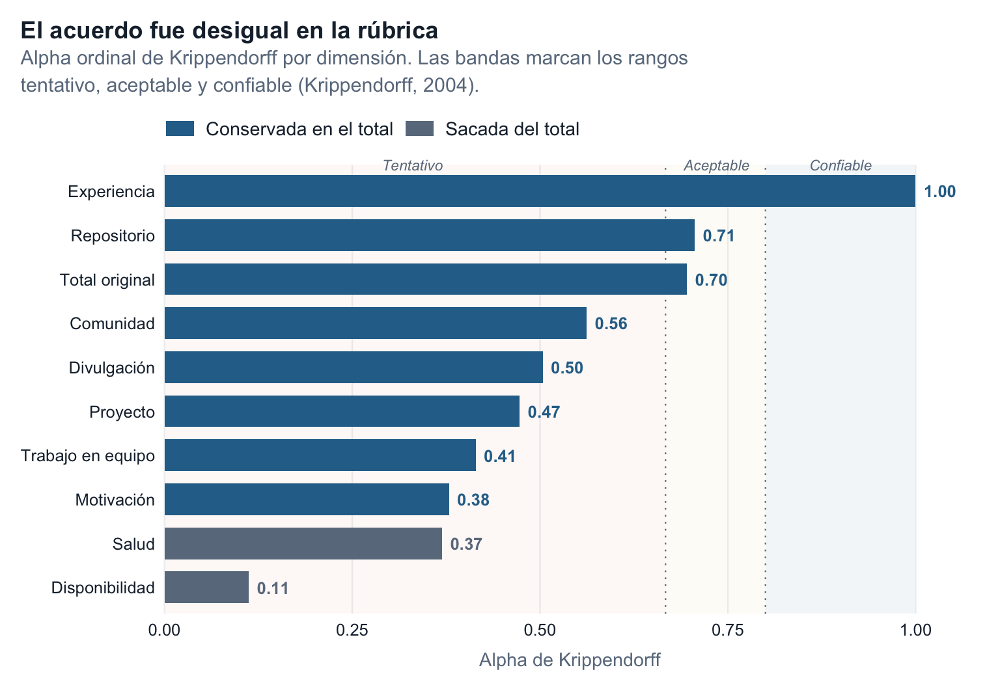

Hace dos años describimos el [proceso de selección de campeones](/blog/2024/04/18/champions-program-2024/) que utilizamos en el programa Champions y prometimos seguir midiendo el acuerdo entre quienes revisan las propuestas. Volvimos a medirlo y queremos contarles qué aprendimos a partir del desacuerdo.

Aprendimos tres cosas. Primero, los revisores estarán de acuerdo en algunos aspectos, pero discreparán en otros. Segundo, ese desacuerdo no es el punto final, sino el punto de partida. Tercero, ese punto de partida nos lleva a conocer mejor y a interesarnos aún más por las historias y los proyectos de quienes se postulan.

Escribimos este texto con dos propósitos. Por un lado, queremos ayudar a quienes se postulen en el futuro, dándoles mayor claridad y algunas pistas sobre qué información incluir y cómo estructurarla. Por otro, queremos registrar lo que aprendimos durante la revisión de las propuestas y compartirlo con otras personas que participen en procesos de evaluación similares.

## Los revisores van a discrepar más en unos ítems que en otros

Nuestros revisores son [miembros de la comunidad](https://ropensci.org/blog/2025/06/05/mentors-2025/) que se postularon para ser mentores de quienes resulten seleccionados para el programa Champions. Una vez elegidos, comienzan su participación revisando y calificando algunas de las postulaciones. Para ellos, este proceso también representa un aprendizaje y una oportunidad para conocer a quienes podrían ser sus tutorados. Sin embargo, el número de postulaciones siempre es mayor que el de mentores. Por eso usamos un diseño de calificación incompleto. En la cohorte de 2026, cada postulación fue revisada por al menos dos personas. En total, participaron 79 postulantes y 12 revisores, que completaron 158 revisiones. La figura 1 muestra este diseño de evaluación.

Ese diseño nos deja dos evaluaciones por postulación. Y, claro, partimos de que *cada cabeza es un mundo*.

En la figura 2 vemos discrepancias entre los puntajes totales asignados por los revisores. Por ejemplo, las líneas naranjas corresponden a postulaciones para las que los puntajes difieren en tres o más puntos —como se dice en Colombia, *se pasaron tres pueblos*—. En otras palabras, los revisores leyeron la misma postulación, pero juzgaron su contenido de forma distinta. Esa dispersión es esperable y constituye la base para aprender de esta experiencia.

En la figura 3 calculamos el grado de acuerdo entre los revisores para cada dimensión de la rúbrica de evaluación. Un puntaje de 1 indica un acuerdo perfecto y uno de 0, una ausencia de acuerdo más allá de lo esperable por azar. A *vuelo de pájaro*, se observa que las mayores diferencias no aparecieron ni en la evaluación de la experiencia ni en la de los repositorios. Esto tiene sentido, pues nuestros mentores tienen experiencia revisando y navegando repositorios. Además, han participado en numerosos procesos y proyectos, lo que les permite conocer los distintos trabajos de las comunidades e identificar con facilidad qué significa tener experiencia.

La dimensión de comunidad comienza a mostrar algunas diferencias, aunque todavía no son muy grandes. Para interpretar este resultado, entendemos la participación en una comunidad a través de acciones concretas: crear contenidos, asistir a eventos, apoyar a otras personas y producir ciencia abierta. Todas estas son actividades que nuestro programa busca fomentar y que reflejan los valores de la comunidad a la que también pertenecemos.

Donde las cosas se complican es en divulgación, proyectos, trabajo en equipo y motivación. Veamos estas dimensiones una por una. Empecemos por la divulgación, una actividad a la que muchas personas no están acostumbradas. En América Latina existe tradicionalmente la tendencia a no mostrar demasiado nuestro trabajo, pues hablar de nuestros logros puede parecer presuntuoso o una falta de humildad. Esto se refleja en las postulaciones: muchas no explican con suficiente detalle los aportes increíbles de quienes se postulan ni los proyectos en los que han participado. Aquí vale la pena recordar que *al que no habla, Dios no lo oye*.

En cuanto a los proyectos, el principal aprendizaje es para nosotros. Necesitamos definir con mayor claridad qué esperamos en esta dimensión y cómo queremos que se estructure la información. Por ejemplo, si pensamos que el resultado será un paquete, debemos precisar qué aspectos de ese paquete debe describir la propuesta y qué características esperamos que tenga. Una estructura más clara nos permitiría evaluar los proyectos con criterios más consistentes.

El trabajo en equipo también generó desacuerdos. Hay una paradoja: la ciencia abierta se construye de forma colaborativa, pero aprender a colaborar requiere tiempo y acompañamiento. Por eso, en futuras postulaciones nos gustaría encontrar ejemplos concretos que muestren cómo la persona ha trabajado con otras: qué papel desempeñó, cómo tomaron decisiones y qué lograron en conjunto.

La motivación es otro asunto: es precisamente lo que lleva a las personas a postularse. Sin embargo, resulta difícil reconocer qué motiva de manera particular a cada persona, porque muchas postulaciones recurren a las mismas razones y palabras. En nuestro caso, la motivación es un aspecto concreto, ligado a las ideas, los programas y las necesidades de las comunidades que podrían beneficiarse de los paquetes desarrollados durante Champions.

Finalmente, hubo dos dimensiones en las que definitivamente no observamos acuerdo: salud y disponibilidad. Esto representa, sobre todo, una recomendación para nosotros mismos: *en casa de herrero, azadón de palo*. Quisimos favorecer proyectos enfocados en la salud, pero descubrimos que «salud» puede abarcar muchas cosas: medioambiente, medicina, células, datos y prevención, entre otras. Como la categoría era tan amplia, cada revisor podía interpretarla de forma distinta. En la próxima convocatoria necesitaremos precisar si nos referimos a la salud humana y la medicina o si también incluimos, por ejemplo, la salud ambiental y el bienestar.

En cuanto a la *disponibilidad*, las postulaciones reflejan realidades muy distintas: hay personas que cursan doctorados, tienen varios trabajos, se están mudando o atraviesan momentos de transición. Esta variedad hace difícil convertir la disponibilidad en un puntaje simple. Champions no debería ser una carga, sino un espacio flexible donde las personas puedan desarrollar sus ideas y conectarse con la comunidad, tanto en nuestros eventos como en reuniones individuales con sus mentores. Para la próxima convocatoria debemos formular mejor este criterio: queremos conocer las condiciones que permitirían a cada persona aprovechar el programa, no favorecer a quien tenga la agenda más libre.

## El desacuerdo no es el punto final

Hay quienes programan con R base y quienes prefieren determinados paquetes y estilos. Algo parecido ocurre al revisar postulaciones: algunas personas tienden a asignar puntajes más altos y otras usan un listón más exigente.

Esta diferencia no sería un problema si todas las postulaciones fueran evaluadas por las mismas personas. Pero, como vimos, nuestro diseño es incompleto. A algunas les corresponden revisores más estrictos y a otras, revisores más generosos. Si comparáramos únicamente los puntajes brutos, una postulación podría quedar más abajo porque le tocó un jurado exigente, no porque su proyecto estuviera menos alineado con nuestros criterios.

Para medir con la misma vara, aplicamos un modelo que estima la tendencia de cada revisor a asignar puntajes más altos o más bajos. Después ajustamos los totales para separar, hasta donde es posible, el efecto del estilo de evaluación de la valoración de cada postulación. Así podemos comparar propuestas aunque no hayan sido revisadas por las mismas personas.

Sin embargo, ajustar los puntajes no elimina el desacuerdo ni debería ocultarlo. Las diferencias nos señalan qué criterios necesitan definiciones más claras y qué casos merecen una conversación más profunda. Por eso el desacuerdo no es el resultado final, sino información para mejorar el proceso.

## Un proceso más justo necesita mirar más allá de los puntajes

Nuestro proceso es ciego: no vemos nombres ni contamos con datos que identifiquen a las personas. Sin embargo, una postulación anónima todavía puede contar la historia de quien la presenta: qué problema quiere resolver, qué ha construido, cómo trabaja con su comunidad y por qué su proyecto importa. Algunas propuestas hacen visible esa historia; otras dejan piezas importantes fuera.

Por eso recomendamos a quienes se postulen en el futuro que no se limiten a enumerar su experiencia ni a responder cada sección de manera aislada. Una propuesta debería conectar su trayectoria, las necesidades de su comunidad y el proyecto que quiere desarrollar. Para quienes evaluamos, la tarea consiste en leer esas historias sin reducirlas a un número y comprobar que nuestros criterios permitan reconocerlas de manera consistente.

Medir el acuerdo nos permitió ver dónde coincidimos, dónde necesitamos criterios más claros y dónde debemos detenernos a conversar. Los puntajes ayudan a ordenar el proceso, pero no sustituyen la lectura atenta de las historias y los proyectos. Esa es quizá nuestra conclusión más importante: un proceso más justo no busca borrar las diferencias entre revisores, sino entenderlas y convertirlas en mejores preguntas, criterios y conversaciones.

En esta cohorte seleccionamos personas y proyectos maravillosos, con ideas de gran impacto. Les damos la bienvenida al programa Champions y esperamos que disfruten el proceso, aprendan y encuentren una comunidad que acompañe sus ideas. Gracias a todas las personas que se postularon y a quienes revisaron las propuestas por su entusiasmo, dedicación y compromiso. Compartimos estos aprendizajes con la esperanza de que sean útiles para futuras postulaciones y para otras comunidades que estén diseñando sus propios procesos de evaluación.
